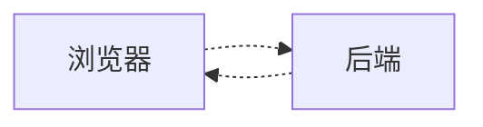

# 执行摘要

本项目旨在构建一个**AI 人格引擎（AI Persona Engine）**，通过模块化的方式集成语音识别（ASR）、大语言模型（LLM）+Persona/Skill、语音合成（TTS）和数字人驱动模块，实现实时的人机语音交互。第一个Persona演示为“张雪峰高考咨询”，但核心是设计可替换的接口，后续可接入其他人物。项目技术成熟度高，可借助现有开源方案完成，主要价值在于**完整的系统架构与工程实现**。本设计文档涵盖目标、架构、模块接口、技术选型、里程碑、性能和测试指标、扩展方向、风险缓解等内容，并提供开发任务清单和示例Prompt，供后续使用Claude Code等AI工具快速开发使用。

**项目目标**：提供一个可插拔的实时AI数字人交互平台，用于技术演示和教育咨询（如高考志愿指导）。目标受众是技术团队和教育用户。成功指标包括：系统能够稳定运行并实现语音问答闭环；开源后有示例Demo；方便在面试中展示技术架构和流式交互能力。

**技术路线**：用户语音 → ASR（Whisper/Faster-Whisper）→ 人格层（含Prompt+Skill+LLM）→ 文本回答 → TTS（CosyVoice/GPT-SoVITS/FishSpeech）→ 数字人口型驱动（LivePortrait/MuseTalk等）→ 视频输出。所有模块通过WebSocket/REST串联，实现低延迟流式通信。下图示例展示了系统流程及模块：  

 *图：AI 人格引擎主要模块流程（示例，可替换不同ASR/LLM/TTS/Avatar）*

```mermaid
flowchart TB
  subgraph 浏览器端
    Mic(麦克风采集音频) 
    Player(显示视频&字幕) 
  end
  subgraph 服务器端
    ASR[语音识别 (Whisper)] 
    Persona[Persona接口/技能] 
    LLM[大语言模型] 
    TTS[语音合成 (CosyVoice)] 
    Avatar[数字人驱动 (LivePortrait)]
  end
  Mic -- 音频流(WebSocket) --> ASR
  ASR -- 转文字 --> Persona
  Persona --> LLM
  LLM -- 文本响应 --> TTS
  TTS -- 音频流 --> Avatar
  Avatar -- 视频流(WebRTC) --> Player
```

## 项目目标

- **为什么做**：演示完整的AI交互流水线，学习并展示ASR、LLM、TTS、数字人等多模块集成能力。提供一个“AI数字人咨询平台”Demo，通过热点IP（如张雪峰风格）吸引关注，同时易于扩展其他人物。  
- **非目标**：**不**研发新算法，不**不**重点优化单个模型性能；**不**替代专业咨询，仅做技术演示和辅助参考。  
- **目标受众**：技术面试官和教育用户（学生、家长等）。前者看重工程能力和完整性，后者关注交互效果和内容价值。  
- **成功衡量指标**：系统能实现连续对话问答（流式输出、实时交互），前端可通过网页演示；开源后获得星标和社区反馈；面试时可用Demo直观展示系统能力；实际用户体验中延迟<2秒。  

## 系统架构

系统由前端（浏览器/WebAPP）和后端若干服务组成，采用**FastAPI+WebSocket**实现流式通信。主要模块包括：**ASR接口**（接收音频、返回文本）、**Persona接口**（构建Prompt并调用LLM，结合Persona逻辑/Skill）、**TTS接口**（接收文本、输出音频流）、**Avatar接口**（接收音频流、生成同步视频流）。前端负责音视频流的采集与展示，后端按序处理。通信示意如下：  



  
*图：AI 人格引擎整体架构示意图（浏览器与服务器交互、主要数据流）；各模块通过接口解耦，便于替换底层实现。*

**通信协议**：浏览器与后端通过**WebSocket**实现双向流式通信（音频数据块、文本/音频/视频分段），HTTP用于启动/配置请求。可以考虑局部使用WebRTC做视频推流，或OBS串流输出Avatar画面。**流式处理点**：ASR可流式接收音频块并增量返回文字（Streaming ASR），LLM可流式生成文本（Streaming API），TTS采用流式wav输出，Avatar接受音频分段生成对应视频帧（WebRTC输出）。

## 目录结构与部署拓扑

**目录结构示例**：  
```
AI-Persona-Engine/
├─ backend/                # 后端服务
│   ├─ app.py              # FastAPI主入口
│   ├─ speech_interface/   # ASR模块（Whisper等）
│   │   └─ asr_service.py
│   ├─ persona_interface/  # Persona逻辑
│   │   ├─ persona.py
│   │   ├─ zhangxuefeng/    # 张雪峰Persona配置
│   │   │   ├─ prompt.txt
│   │   │   └─ skills.py
│   │   └─ hr/              # HR人格示例
│   │       ├─ prompt.txt
│   │       └─ skills.py
│   ├─ tts_interface/      # 语音合成（CosyVoice等）
│   │   └─ tts_service.py
│   ├─ avatar_interface/   # 数字人驱动（LivePortrait等）
│   │   └─ avatar_service.py
│   ├─ config/             # 配置文件（YAML/JSON）
│   │   └─ app_config.yaml
│   └─ utils/              # 辅助模块（缓存、队列等）
│       └─ logger.py
├─ frontend/               # 前端项目（如Vue/React）
│   └─ src/
│       ├─ components/     # 视频、字幕、麦克风等组件
│       └─ App.vue
├─ docker-compose.yml      # 容器部署示例
└─ README.md               # 项目说明
```

**部署拓扑**：可采用单机Docker Compose或K8s部署。示例部署：
- FastAPI服务容器（包括ASR/Persona/TTS/Avatar模块）
- 前端静态服务器（或混合在FastAPI）
- Redis或内存队列（用于模块间缓存/队列）
- GPU（用于加速ASR/TTS/Avatar推理）
可按需拆分独立容器，如ASR、Persona+LLM、TTS、Avatar各自独立，以提高可扩展性。

## 模块接口定义

### Speech Interface（ASR接口）

- **功能**：接收音频流（PCM/WAV），输出文字文本。可选多语种识别、分段实时返回。
- **实现**：基于 Whisper、Faster Whisper等开源库。
- **输入/输出**：  
  - 接口示例（WebSocket二进制流）：客户端持续发送音频帧，服务端流式返回识别结果JSON。  
    ```json
    {"event": "transcript", "text": "老师，我山东620分，计算机还能报吗？"}
    ```  
  - 或REST API：POST wav文件，返回JSON `{"text": "...", "language": "zh"}`。
- **技术选型**：Whisper-large (准确率高)、Faster Whisper (实时性好)。配合Silero VAD可实现语音活动检测，提高实时交互体验。

### Persona Interface（人格层）

- **功能**：接收用户文本问题，结合Persona配置（角色说明、技能函数、知识库）构建Prompt，并调用LLM生成回复文本。  
- **结构**：主要包含角色Prompt模板、Skill定义（如志愿规划Skill脚本）、可选RAG/数据库、对话历史上下文。  
- **输入/输出**：  
  - 输入：`POST /chat`，JSON包含`{"persona": "zhangxuefeng", "history": [...], "question": "..."}`。  
  - 输出：生成回应文本`{"answer": "xxx", "skills_used": ["..."]}`。
- **例子**：  
  ```json
  // 请求
  { "persona": "zhangxuefeng", "question": "请给我志愿填报建议，分数620", "history": [] }
  // 响应
  { "answer": "620分想冲计算机? 先看省内..." }
  ```
- **技术选型**：可使用OpenAI/ChatGPT、Qwen、Claude等LLM API；使用现有开源Skill（如[张雪峰Agent Skill](https://github.com/xxx)）；可集成向量检索(RAG)对接高校数据。
- **注意**：Persona层负责业务逻辑与内容安全，可包含敏感度过滤。用户问题如果高风险（如敏感、法律等），返回免责声明语句。

### Voice Interface（TTS接口）

- **功能**：接收输入文本/标记（包含语气提示等），输出语音音频流。  
- **输入/输出**：  
  - 接口：可支持Streaming API。如`POST /tts/stream`发送`{"text": "...","voice":"zhangxuefeng"}`，服务端流式返回wav数据块。  
  - 示例返回（WebSocket二进制）：分段PCM流，用于实时播放和驱动数字人。  
- **技术选型**：开源TTS模型如**CosyVoice**（快速、清晰），**GPT-SoVITS**（自然、有韵律）、**Fish-Speech**（近期表现优异）。可选择中文预训练模型，如Tsinghua skit-TTS等。  
- **注意**：需尽量降低延迟（流式合成），可通过接管显存预热、控制batch size等优化响应速度。使用神经声码器（HiFi-GAN、PriorGrad）以提高音质。

### Avatar Interface（数字人驱动）

- **功能**：接收音频（或对应文本与时间信息），生成同步的数字人视频流。  
- **输入/输出**：  
  - 输入：音频流（PCM、wav）。  
  - 输出：实时视频流（含口型同步、表情等）。可通过WebRTC推送到前端或OBS推流。  
- **技术选型**：现有项目**LivePortrait**（音频驱动高清动画）、**MuseTalk**、**HeyGen**等。也可使用MediaPipe或Wav2Lip技术做口型同步。  
- **注意**：应在保证低延迟（<300ms）基础上使口型与音频对齐。若使用训练方法（如生成视频），通常延迟高且需要大量数据；首选无需训练的可运行方法。

### Frontend（前端交互）

- **功能**：实现用户界面，采集麦克风音频，显示视频和字幕，实时渲染回复。  
- **技术选型**：Vue3或React，结合Web Audio API/WebRTC/WebSocket。页面元素：麦克风按钮、视频展示区、字幕区、系统状态（延迟指标）。  
- **接口**：前端通过`WebSocket`同时发送音频流和接收视频/字幕流。也可通过MediaStream转WebRTC直连Avatar输出。

### Logging/Monitoring（日志与监控）

- **功能**：记录各模块延迟、请求轨迹、错误日志。  
- **指标**：ASR时延、LLM生成时间、TTS延迟、帧率、错误率等。  
- **实现**：可使用Python logging记录，Prometheus+Grafana监控指标。  
- **示例日志**：`[INFO] ASR latency: 0.8s, LLM latency: 1.2s, TTS latency: 0.5s, Frame rate: 30fps`。

### Config（配置管理）

- **内容**：模块开关，模型路径，Persona配置（如角色名称、提示模板路径）、外部API Key，资源限制等。  
- **实现**：YAML/JSON配置文件。可定义多种Persona和可选方案，如：  
  ```yaml
  personas:
    - name: "zhangxuefeng"
      prompt: "./persona/zhangxuefeng/prompt.txt"
      voice_model: "cosyvoice_zh"
      avatar_model: "liveportrait_v1"
      skills: ["gaokao_planning"]
  asr:
    model: "faster_whisper"
  tts:
    cosyvoice_model: "pretrained/cosy-zh"
  ```

## 技术选型及可替换方案

| 模块        | 推荐方案             | 可替换方案               | 优点                           | 缺点/风险              | 参考（中文/官方）         |
|-------------|----------------------|--------------------------|-------------------------------|------------------------|---------------------------|
| **ASR**     | Whisper/Faster-Whisper | SenseAudio（商用）、百度飞桨ASR | 识别率高、支持中文多场景 | 需要GPU支持，有噪声敏感 | [OpenAI Whisper文档]、阿里云ASR文档 |
| **LLM**     | OpenAI ChatGPT-4、Qwen-7B（本地） | Claude、BLOOM、Llama2    | 语义理解强、Persona定制化   | API有延迟、需Token控制    | OpenAI文档、MOSS/通用大模型论坛 |
| **Skill/Agent** | 现成Persona Skill（如**张雪峰Skill**） | 自定义Prompt或流行Agent框架 | 即插即用，包含决策逻辑    | Persona偏见需校验         | 张雪峰Skill repo |
| **TTS**     | CosyVoice、FishSpeech（opensource） | Azure Neural TTS、Azure Custom Voice | 反应快、支持流式输出        | 商用API成本、隐私          | CosyVoice官网、AzureTTS中文介绍 |
| **声克隆**  | **RVC**（Retrieval-based VC） | SV2TTS、VITS              | 高保真克隆、实时性能好 | 需GPU资源、音色一致性依赖 | RVC项目文档、SV2TTS论文 |
| **Avatar**  | LivePortrait、HeyGen | DFLive2D/Wav2Lip          | 即插即用、逼真度高 | 需显卡高性能           | LivePortrait文档 |
| **前端**    | Vue3 + WebSocket/VueStore | React / Angular         | 界面灵活、社区成熟           | 需跨域/WebSocket配置     | Vue3官网、MDN WebSocket |
| **部署**    | Docker Compose、FastAPI | Kubernetes、Gunicorn     | 易部署调试，API吞吐足       | Compose运维较K8s弱      | Docker文档、FastAPI指南 |

### 技术选型说明

- **ASR**：Whisper准确率高，**Faster-Whisper**在实时性上更优。开源免费，支持多语言。但资源占用大。若需云API可选百度/腾讯ASR，免部署但有费用和隐私顾虑。  
- **LLM**：若使用OpenAI API，体验最好；国内可选**山石国研Qwen**系列本地模型，也已开源。需注意要流式返回TOKEN来驱动连麦体验。若需自控可用**Llama2**等微调。  
- **Skill/Agent**：已有人做好的**张雪峰Skill**，可以直接集成。也可使用RASA/Fastchat等来管理对话流程。开源Skill降低了工作量。  
- **TTS**：**CosyVoice**（腾讯开源）合成快、质量好，支持简单部署。**Fish-Speech**（GitHub）近年来表现优异，且免费。**Azure Neural TTS**效果极佳但商业化，需要注意成本和使用限制。  
- **Voice Cloning**：RVC（开源，MIT许可证）可用几分钟音频快速训练单人模型，实现声音克隆；对设备要求高。其他如**SV2TTS**需要数据量大，复杂度高。  
- **Avatar**：**LivePortrait**等开源项目无需训练，可直接将一张肖像驱动成说话视频；**HeyGen**等商用服务可快速生成。但考虑到是开源项目，优先用开源API，避免商用依赖。  
- **前端**：Vue3社区支持多，有丰富的UI库；需与后端WebSocket对接。推荐以**单页应用(SPA)**形式设计。  

优先使用中文资料：如[CSDN教程](https://www.cnblogs.com/search/?q=Whisper+FastAPI)和官方文档。注意开源组件许可（如RVC的MIT许可证友好、部分商业TTS需审慎）。

## 里程碑

### MVP （1周内）

- **目标**：实现最简闭环语音问答，验证架构。  
- **任务**：  
  1. 快速搭建FastAPI骨架，集成**Whisper** ASR（本地或API）。  
  2. 前端实现录音并发送音频，接收识别结果并显示。  
  3. 直接调用LLM（如OpenAI API）或简单Echo模型，返回文本答案显示。  
- **验收**：可在网页上「点击说话 → 识别文字 → 返回文字回答」全流程可视化。  
- **工作量**：3人天。

### V1（2周）

- **目标**：加入**TTS和视频**，形成语音对话和数字人回应。  
- **任务**：  
  1. 集成**CosyVoice**或FishSpeech TTS，完成输入文本→输出wav流。  
  2. 前端播放TTS音频并同步显示文字字幕。  
  3. 集成**LivePortrait**或MuseTalk Avatar驱动，同步生成视频。  
  4. 简单界面美化，显示数字人视频画面。  
- **验收**：实现「讲话 → ASR识别 → LLM生成 → TTS播放 + Avatar口型 → 显示回音视频」闭环，测试质量与延迟。  
- **工作量**：7人天。

### V2（3周）

- **目标**：完善Persona逻辑、插件化架构与性能。  
- **任务**：  
  1. 实现Persona配置机制：支持多Persona目录，加载对应Prompt/Skill。  
  2. 集成开源**张雪峰Skill**逻辑，提供真实的志愿规划回答。  
  3. 增加对话上下文管理，令对话多轮进行。  
  4. 支持WebSocket全程流式：ASR流式结果触发LLM，LLM流式输出至TTS，TTS音频分段送入Avatar。  
  5. 性能优化与监控：记录端到端延迟（目标初步≤2秒），日志统计。  
- **验收**：能够长时间稳定连麦演示，高考问题能给出相对靠谱回答；参与演示者体验流畅、交互自然。  
- **工作量**：15人天。

### 后续（持续迭代）

- **V3**：多Persona、多通道：支持用户选择人格（如HR、老师）、多人连麦（同一房间多人参与）；**RAG**接入高校数据库，回答高考和职业问题更准确。  
- **V4**：OBS/RTMP直播集成：可将Avatar输出直接推流至抖音等平台；商业化验证；移动端适配。  

**并行化建议**：初期前后端可并行开发；MVP实现后，组内分别细化ASR-TTS-Avatar管线优化与Persona内容建设。Claude Code等AI助理可并行写各模块模板和示例代码。

## 性能目标与测试方案

- **首包延迟**：从用户说话结束到数字人开始回答，目标≤2秒；争取优化到1s内。
- **流式响应吞吐**：支持无缝对话，每秒钟可处理音频帧（16kHz）约100帧；LLM流式输出每秒稳定50-100字符（视模型）。
- **并发用户数**：初期单用户Demo即可；扩展时可在GPU设备或多容器上部署，支持数十用户并发（视GPU资源）。  
- **资源估算**：常见配置GTX3060即可运行Whisper和CosyVoice。Avatar（LivePortrait）需强显卡，如RTX40系列推理实时。**CPU**：用于后端框架，8核以上；**内存**：16GB以上。  
- **监控指标**：ASR延迟、LLM延迟、TTS延迟、Avatar合成FPS、显存占用、QPS。可使用Prometheus收集，Grafana展示。  
- **压测方法**：使用Locust或自制脚本模拟多用户并发发送音频和请求，检查延迟抖动和系统吞吐。重点测试持续对话（长对话历史）和瞬时提问时延。

## 后续扩展方向

- **更多Persona**：除张雪峰，可定制**雷军、HR面试官、科目教师、心理咨询师**等；每个Persona对应不同Prompt、Skill、声音、头像。  
- **更多TTS/声线**：接入多种音色，如LJSpeech、LibriTTS，支持不同性别、口音；集成第三方商用TTS（11Labs、Azure）作比较。  
- **RAG知识库**：将高校/职业数据建入向量库，结合LLM进行RAG检索，提高答案正确率。  
- **多角色连麦**：支持多人提问、AI与多用户互动，或多个AI角色轮番发言。  
- **OBS/直播集成**：提供OBS插件或RTMP输出，将数字人视频推流到抖音、B站直播间。  
- **移动端支持**：开发移动Web/APP端，实现随时随地连麦体验。  
- **商业化注意**：如未来商业使用，需注意肖像授权、内容审核、服务稳定性等。

## 风险与缓解

- **法律/肖像权风险**：使用已故名人（张雪峰）形象可能有争议。缓解措施：明确标注“AI生成仿真，不是真人发言”；隐去具体肖像，使用卡通化头像或通用形象；页面和回答增加免责声明，例如「本系统为AI模拟，仅供参考」；非商业开源降低法律风险。  
- **声音克隆伦理**：如果使用张雪峰实际录音克隆声音，应避免未经许可。可使用类似东北口音的代言人语音；若非公开人物，原则上需本人授权。  
- **误导风险**：用户可能将系统输出当真建议。设计上避免直给招生具体建议，而是提供信息分析和多种选项；对敏感问题（医疗、法律等）一律委婉拒绝并提示咨询专业人士。  
- **延迟/同步问题**：网络延迟或串流卡顿会影响体验。需优化模块延迟（使用流式接口，细粒度推送），前端使用WebRTC低延时推视频。可在UI上实时显示“思考中…”状态，以缓解长延迟带来的用户焦虑。  
- **模型幻觉**：LLM可能产生错误信息。可在回答中加入**知识来源声明**，避免过度确定陈述；对于高校信息等，可在RAG检索不足时提示「根据已知信息，无法确认」。并保留人工复审可能。  
- **滥用风险**：有人可能用该平台进行恶搞或传播虚假信息。可采用敏感词过滤、监控问答内容，必要时锁定单一人格演示场景。  
- **合规措辞示例**：  
  - 页面显著位置注明：“**AI生成内容，仅供参考**，不构成权威咨询。”  
  - 对话框中标注“”前缀。  
  - 免责声明弹窗：“本系统模拟AI数字人助手，以下建议仅供参考，请结合官方信息和专业人士意见决策。”  
- **UI提示示例**：在视频下方或字幕中显示提示语，如“正在生成回答…”、“模拟人物：张雪峰”。  

## 关键技术难点：人声语气和表现力

要让TTS输出“像真人”一样有韵律和情感，主要涉及**声学模型**和**声码器**技术。以下为重要技术点及实现思路：

- **语气风格建模**：可以使用**风格嵌入（Style Tokens）**、情感标签等方法将不同说话风格编码。Google的GST模型就是示例，可通过少量示例音频让TTS学习说话的风格。  
- **语调迁移**：无需完全从头训练的方案是**prosody transfer**，将目标句子的韵律和情感投射到合成上；如Tacotron2+GST、Microsoft的NaturalSpeech通过VAE学习整体音调（参见）。短期内可尝试开源 **FineSpeech/AdaSpeech** 等技术，实现少量录音风格迁移。  
- **声码器（Vocoder）**：最新神经声码器（如HiFi-GAN、PriorGrad等）能生成更自然声音。使用高质量声码器对输出音频细节提升巨大。  
- **Voice Cloning工具**：**RVC**（取样式语音转换）无需多语言或文本对应，仅用录音克隆声纹。RVC可做到几分钟音频训练，实时转换。**Glow-TTS/YourTTS**等也可通过少量样本fine-tune获得新说话人音色，但需更多训练。  
- **数据需求**：**短期工程化方案**：使用预训练TTS+style token控制，无需额外数据，只依赖预训练模型的风格能力。例如Chinese CosyVoice已有多个声线。  
- **长期优化方案**：收集**成对数据**（录制张雪峰读文本）用于**模型微调**。比如收集3-5分钟高质量音频，可在RVC或自建TTS上进行fine-tune。微软Azure的Custom Neural Voice要求几十分钟录音，有强监督需求。  
- **开源工具/论文**：  
  - RVC项目 ([GitHub](https://github.com/RVC-Project/Retrieval-based-Voice-Conversion-WebUI), MIT 许可)。  
  - StyLe Transfer TTS：Global Style Tokens（GST）；VITS变种，如Meta-StyleSpeech；微软NaturalSpeech中文介绍。  
  - Neural Vocoder: HiFi-GAN, WaveGrad, MB-WaveRNN等（中文比较见知乎专栏）。  
  - 更多：Tacotron2、AdaSpeech系列（百度），Microsoft DelightfulTTS（Blizzard竞赛冠军），FastSpeech2+experSS等现代架构。  

**可行路径**：初期可选用CosyVoice自带的若干声线组合，配合少量prosody提示词实现语调变化；后期如需更真实可尝试RVC微调自建模型，或研究Wave2Lip同步嘴型。

## 开发任务清单

以下为可复制到Claude Code的任务列表（分文件/函数级）及示例Prompt模板示例：

### Task List（示例）

- **文件** `backend/app.py`：  
  - 函数`start_asr_stream()`：开启WebSocket监听音频流，调用`speech_interface.transcribe()`分段识别。  
  - 函数`process_question(text, persona)`：调用`persona_interface.generate_response()`。  
  - 函数`tts_streaming(text, voice)`：启动TTS合成流，逐块发送到前端/Avatar。  
- **文件** `backend/speech_interface/asr_service.py`：  
  - `def transcribe(stream): return text`（接收音频流，返回文本）。  
- **文件** `backend/persona_interface/persona.py`：  
  - `def generate_response(persona_name, question, history):` 整合Prompt模板和Skill，调用LLM。  
- **文件** `backend/tts_interface/tts_service.py`：  
  - `def synthesize(text, voice_model): return audio_chunks`。  
- **文件** `backend/avatar_interface/avatar_service.py`：  
  - `def generate_video(audio_stream, avatar_model): return video_stream`。  
- **文件** `frontend/src/App.vue`：  
  - 组件`Microphone`：采集用户音频并通过WebSocket发送。  
  - 组件`VideoPlayer`：接收WebRTC视频流并播放；`Subtitle`：显示文本。  

### 示例Prompt模板

- **Persona引导**（张雪峰风格）：
  ```
  你是一位高考志愿规划专家张老师。以下为张雪峰的表达风格关键词："我告诉你","千万别","对你而言","反正你这个分数"，喜欢举生活例子。请根据学生提问，给出专业建议。
  问题：{question}
  回答：
  ```
- **Skill模板**（志愿填报）：
  ```
  // 读取学生成绩，推荐专业和学校
  - 读取学生分数rank和位次
  - 根据分数拟定保底、冲刺名单
  - 考虑专业兴趣和就业情况
  ```
- **TTS调用**：
  ```
  POST /tts/stream
  {
    "text": "{answer_text}",
    "voice": "zhangxuefeng_voice",
    "style": "normal"
  }
  ```
- **流式生成**（WebSocket）：
  ```
  Client -> Server: { "event":"start_stream", "session_id":123 }
  Server -> Client: { "event":"transcript_chunk", "text":"..."}
  Server -> Client: { "event":"tts_chunk", "audio": "<binary>"}
  Server -> Client: { "event":"video_frame", "data": "<binary>"} 
  ```

### 优先参考资料

- **官方文档/指南**：Whisper FastAPI 教程、FastAPI官方、Vue/WebRTC教程、Docker Compose文档。  
- **开源仓库**：`elevenyellow/PersonaEngine`、RVC-Project、CosyVoice GitHub、LivePortrait。  
- **论文/技术博客**：Style Tokens（中英文解释）、微软NaturalSpeech报告、知乎TTS综述、CSDN语音合成综述等。  
- **社区文章**：Linly-Talker（中文解读）、**黑豹**张雪峰Skill介绍文章，以及技术媒体对AI数字人的介绍。

## 下一步行动（2–3天工作清单）

1. **绘制详细架构图**（增加模块间交互、具体协议）：根据上述Mermaid草图完善流程图并输出PNG，用于项目文档。  
2. **编写项目设计文档**（即本报告）：将本结构丰富细化为团队指导文档。  
3. **启动MVP开发**：用Claude Code快速生成ASR+LLM基础代码原型，验证语音问答闭环；同时搭建项目骨架（目录、Dockerfile等）。  
4. **收集Persona资源**：准备张雪峰风格提示语和可能的自定义Skill；录制或获得示例音频片段（用于后续训练需求分析）。  
5. **环境准备**：测试GPU/推理库环境，选择合适模型与显存占用测试（Whisper、CosyVoice等）。  

以上即项目设计文档要点，按照此架构和任务清单，即可高效启动开发，将此作为Claude Code的上下文和开发计划参考。